---

**HU-01 — Ver ubicación de un bus en el mapa a partir de la búsqueda de una ruta**

> Como usuario público, quiero buscar una ruta y seleccionar un viaje para ver en el mapa la ubicación actual del bus asignado para saber dónde está el bus que quiero tomar.

**Descripción:**

El usuario ingresa a la aplicación y usa el buscador para encontrar una ruta (ej: "San José – Cartago"). El sistema muestra las empresas que la operan y los viajes programados por dicha empresa para el día actual, indicando si cada uno está pendiente, en curso o finalizado. Al seleccionar un viaje en curso, el mapa centra la vista en el bus y se actualiza automáticamente. No se requiere iniciar sesión.


**Supuestos:**

- Solo se muestran viajes del día actual.
- Los estados posibles de un viaje son: Preparado (aún no ha salido), En curso (bus activo en ruta), Finalizado (llegó a destino), y opcionalmente Suspendido (cancelado por causa externa — confirmar con el PO si aplica).
- Los viajes Finalizados se muestran en la lista pero apagados visualmente.
- Los viajes Preparados se muestran en la lista pero al seleccionarlos no se muestra ningún bus en el mapa.
- Solo los viajes En curso muestran un bus en el mapa.
- Cada viaje tiene un bus asignado previamente por el administrador de la empresa.
- No se requiere iniciar sesión para ver el mapa


**Criterios de aceptación:**

- **CA-01** — Cuando el usuario busca una ruta, el sistema muestra las rutas coincidentes con sus empresas y variantes disponibles.
- **CA-02** — Al seleccionar una ruta y empresa, el usuario ve la lista de viajes del día con su estado: _PENDIENTE_, _EN CURSO_ o __FINALIZADO__.
- **CA-03** — Al seleccionar un viaje _en curso_, el mapa muestra el marcador del bus con empresa, número de unidad y ruta.
- **CA-04** — La posición del marcador se actualiza automáticamente cada N segundos sin recargar la página.
- **CA-05** — Al seleccionar un viaje _PENDIENTE_, se muestra el mensaje: "Este servicio aún no ha iniciado."
- **CA-06** — Al seleccionar un viaje __FINALIZADO__, se muestra el mensaje: "Este servicio ya terminó."
- **CA-07** — Si un bus lleva más de N minutos sin actualizar su posición, su marcador cambia visualmente e indica "Última ubicación conocida hace X minutos."
- **CA-08** — Si no hay viajes en curso para la ruta buscada, el mapa aparece vacío con el aviso: "No hay buses en movimiento para esta ruta en este momento."
- **CA-09** — El usuario puede buscar rutas y ver el mapa sin iniciar sesión.


**Definition of Done:**

- [ ]  Buscador, listado de viajes y mapa implementados y funcionando en conjunto.
- [ ]  Los criterios CA-01 a CA-09 están cubiertos por pruebas automatizadas.
- [ ]  Cobertura de pruebas unitarias ≥ 80% en la lógica de filtrado de viajes y actualización de marcadores.
- [ ]  Interfaz funcional en móvil y escritorio.
- [ ]  Sin bugs críticos abiertos relacionados a esta HU.


**Mockup**




---


---

**HU-02 — Ver perfil de una empresa de buses**

> Como usuario público, quiero poder acceder al perfil de una empresa de buses desde los resultados de búsqueda para conocer información básica sobre ella antes o durante mi viaje.

**Descripción:**

El usuario no busca empresas directamente. En cambio, accede al perfil de una empresa desde tres puntos contextuales dentro del flujo normal: el listado de empresas al buscar una ruta, el encabezado de la página de viajes del día, y el tooltip del bus en el mapa. Al acceder, se abre una página con información básica de la empresa. No se requiere iniciar sesión.

**Supuestos:**

- No existe un buscador de empresas. El acceso al perfil es siempre contextual, desde donde la empresa ya aparece naturalmente.
- El perfil es de solo lectura para el usuario público.
- La información del perfil la gestiona el administrador de la empresa (ver E-03).
- Si una empresa no ha completado su perfil, se muestra igualmente la página con los datos disponibles.

**Criterios de aceptación:**

- **CA-01** - Al buscar una ruta, cada empresa del listado se muestra como una fila seleccionable. Al hacer clic en cualquier parte de la fila (excepto el ícono de información), el usuario accede a los viajes del día de esa empresa. Un ícono (⋮ o ⓘ) al lado derecho de cada fila lleva a su perfil.
- **CA-02** — En la página de viajes del día, el encabezado con el nombre de la empresa incluye un enlace a su perfil.
- **CA-03** — En el tooltip del bus en el mapa, el nombre de la empresa es un enlace que lleva a su perfil.
- **CA-04** — El perfil de la empresa muestra al menos: nombre, descripción y rutas que opera.
- **CA-05** — El usuario puede acceder al perfil sin iniciar sesión.
- **CA-06** — Desde el perfil, el usuario puede volver al punto desde donde llegó.

**Definition of Done:**

- [ ] Página de perfil de empresa implementada y accesible desde los tres puntos definidos en CA-01, CA-02 y CA-03.
- [ ] Los criterios CA-01 a CA-06 están cubiertos por pruebas automatizadas.
- [ ] Interfaz funcional en móvil y escritorio.
- [ ] Sin bugs críticos abiertos relacionados a esta HU.

---

**Mockup:**

```
-------------------------------------------------------------
|  Ruta seleccionada: San José → Cartago                    |
-------------------------------------------------------------

┌───────────────────────────────────────────────────────────┐
│  Empresas que operan esta ruta:                           │
├───────────────────────────────────────────────────────────┤
│                                                           │
│  ┌─────────────────────────────────────────────────────┐  │
│  │  LUMACA                              [ ⋮ ]           │ │
│  │  (toda la fila es cliqueable → ver todas las rutas)  │ │
│  └─────────────────────────────────────────────────────┘  │
│                                                           │
│  ┌─────────────────────────────────────────────────────┐  │
│  │  Autotransportes Moravia               [ ⓘ ]       │  │
│  │  (toda la fila es cliqueable → ver rutas del día)   │  │
│  └─────────────────────────────────────────────────────┘  │
│                                                           │
└───────────────────────────────────────────────────────────┘

Al hacer clic en [⋮] o [ⓘ] → se abre el perfil de la empresa.
Al hacer clic en cualquier otro lugar de la fila → se muestran los viajes del día.
```

---

**HU-03 — Ver viajes del día de una empresa**

> Como usuario público, quiero ver la lista de viajes programados para hoy de una empresa al seleccionarla, para saber a qué hora sale el bus que necesito.

**Descripción:**

Luego de seleccionar una de las rutas de cualquiera de las empresas desde los resultados de búsqueda, el usuario llega a una página que lista todos los viajes del día de esa empresa para la ruta buscada, cada uno con su hora de salida, origen, destino, hora de llegada y estado actual. No se requiere iniciar sesión.

**Supuestos:**

- Esta página es la Pantalla 2 definida en el flujo de HU-01.
- Los estados y reglas de visibilidad de los viajes son los mismos definidos en los supuestos de HU-01.
- La hora de llegada muestra `---` si el viaje está Preparado o Suspendido, y la hora real si está En curso o Finalizado.
- Al seleccionar un viaje Preparado o Finalizado no ocurre ninguna acción de navegación; la fila puede resaltarse visualmente pero no lleva a ninguna pantalla nueva.
- Si la empresa no tiene viajes registrados para hoy en esa ruta, se muestra un mensaje informativo.

**Criterios de aceptación:**

- **CA-01** — Al ingresar a la página, el usuario ve la lista de viajes del día con hora de salida, origen, destino, hora de llegada y estado de cada uno.
- **CA-02** — Cada viaje muestra visualmente su estado: Preparado, En curso, Finalizado o Suspendido.
- **CA-03** — Si no hay viajes registrados para la ruta y empresa seleccionadas en el día actual, se muestra el mensaje: "No hay viajes programados para esta ruta hoy."
- **CA-04** — El encabezado de la página muestra el nombre de la empresa con un enlace a su perfil (ver HU-02).
- **CA-05** — La lista se actualiza automáticamente cada N segundos para reflejar cambios de estado sin recargar la página.
- **CA-06** — Al seleccionar un viaje En curso, el sistema muestra la ubicación del bus en el mapa (ver HU-04).

**Definition of Done:**

- [ ] Página de viajes del día implementada y accesible desde el flujo de búsqueda de HU-01.
- [ ] Los criterios CA-01 a CA-05 están cubiertos por pruebas automatizadas.
- [ ] Interfaz funcional en móvil y escritorio.
- [ ] Sin bugs críticos abiertos relacionados a esta HU.

---

¿Seguimos con HU-04?
**Mockcup**

```
─────────────────────────────────────────────
  ← Cartago – San José
  LUMACA  [ver perfil]
─────────────────────────────────────────────
  Salida    Origen        Destino     Llegada   Estado
  ─────────────────────────────────────────────────────
  05:15     Terminal SJ   Cartago     ---        Preparado
  05:30     Terminal SJ   Cartago     ---        Preparado
  05:45     Terminal SJ   Cartago     06:58      En curso  ●
  06:00     Terminal SJ   Cartago     06:47      Finalizado
  06:15     Terminal SJ   Cartago     ---        Suspendido
  06:30     Terminal SJ   Cartago     ---        Preparado
  ...
─────────────────────────────────────────────
  No hay más viajes programados para hoy.
─────────────────────────────────────────────

```

---


---

**HU-04 — Seleccionar un viaje y ver el bus en el mapa**

> Como usuario público, quiero seleccionar un viaje de la lista y ver el bus correspondiente en el mapa, para saber exactamente dónde está el autobús que voy a tomar.

**Descripción:**

Desde la página de viajes del día (HU-03), el usuario toca un viaje y el sistema lo lleva al mapa con el bus ubicado en tiempo real. Si el viaje no está en curso, el sistema informa el motivo en lugar de mostrar el mapa. No se requiere iniciar sesión.

**Supuestos:**

- Esta página es la Pantalla 3 definida en el flujo de HU-01.
- Solo los viajes En curso llevan al mapa con un bus visible.
- Los viajes Preparados y Finalizados también son seleccionables, pero muestran un mensaje en lugar del mapa.
- El comportamiento del mapa y la actualización automática son los definidos en HU-01.

**Criterios de aceptación:**

- **CA-01** — Al seleccionar un viaje En curso, el usuario ve el mapa centrado en la posición actual del bus con empresa, número de unidad y ruta.
- **CA-02** — Al seleccionar un viaje Preparado, se muestra el mensaje: "Este servicio aún no ha iniciado."
- **CA-03** — Al seleccionar un viaje Finalizado, se muestra el mensaje: "Este servicio ya terminó."
- **CA-04** — Al seleccionar un viaje Suspendido, se muestra el mensaje: "Este servicio fue suspendido."
- **CA-05** — Si un bus pierde la señal, se muestra un mensaje indicando la última posisción y la ultimo tiempo registrado."


**Definition of Done:**

- [ ] Pantalla de mapa implementada y accesible desde HU-03.
- [ ] Los criterios CA-01 a CA-05 están cubiertos por pruebas automatizadas.
- [ ] Interfaz funcional en móvil y escritorio.
- [ ] Sin bugs críticos abiertos relacionados a esta HU.


**Mockup**


---


---

**HU-05 — Ver paradas de una ruta**

> Como usuario público, quiero ver las paradas de la ruta en el mapa y en una lista, para saber por dónde pasa el bus y dónde puedo abordarlo.

**Descripción:**

Dentro de la pantalla del mapa (HU-04), el usuario puede activar un toggle para mostrar las paradas de la ruta como marcadores sobre el mapa. Debajo del mapa se muestra siempre la lista ordenada de paradas con su nombre o referencia. Las paradas pertenecen a la ruta, por lo que son las mismas para todos los viajes de esa ruta. No se requiere iniciar sesión.

**Supuestos:**

- Las paradas son fijas por ruta, no varían entre viajes de la misma ruta.
- Las paradas se muestran en orden de recorrido, de origen a destino.
- Si la empresa actualiza una parada, el cambio se refleja inmediatamente para el usuario.
- La lista de paradas es de solo lectura para el usuario público.

**Criterios de aceptación:**

- **CA-01** — Al activar el toggle de paradas, los marcadores de paradas aparecen sobre el mapa en orden de recorrido.
- **CA-02** — Al tocar un marcador de parada en el mapa, se muestra el nombre o referencia de esa parada.
- **CA-03** — Debajo del mapa se muestra una lista ordenada de todas las paradas de la ruta con su nombre o referencia.
- **CA-04** — Si la empresa modifica una parada, el usuario ve la información actualizada al consultar.

**Definition of Done:**

- [ ] Toggle de paradas implementado y funcional sobre el mapa de HU-04.
- [ ] Lista de paradas visible debajo del mapa.
- [ ] Los criterios CA-01 a CA-04 están cubiertos por pruebas automatizadas.
- [ ] Interfaz funcional en móvil y escritorio.
- [ ] Sin bugs críticos abiertos relacionados a esta HU.

**Mockup:**


---


---

## **HU-22 — Gestionar información básica de la empresa**

> Como administrador de una empresa de transporte, quiero actualizar la información básica de mi empresa para mantener los datos visibles a los usuarios correctos y actualizados.

---

### **Descripción:**

El administrador de la empresa accede al panel de gestión y puede visualizar y editar la información básica de la empresa, como nombre, correo electrónico, teléfono y estado.
Los cambios realizados se guardan en el sistema y se reflejan inmediatamente en las vistas públicas donde aplique.

---

### **Supuestos:**

* Solo usuarios con rol **OWNER** o **ADMIN** pueden gestionar la información de la empresa.
* Cada administrador solo puede modificar la información de su propia empresa.
* El campo `status` permite activar o desactivar la empresa en la plataforma.
* El correo electrónico y teléfono deben ser únicos en el sistema.
* Los cambios quedan registrados en el sistema (auditoría opcional según HU futura).
* No se permite eliminar la empresa desde esta funcionalidad.

---

### **Criterios de aceptación:**

* **CA-01** — Al ingresar al panel de empresa, el administrador visualiza la información actual: nombre, correo, teléfono y estado.
* **CA-02** — Al editar los datos con valores válidos y guardar, el sistema actualiza la información correctamente.
* **CA-03** — Si el administrador intenta guardar un correo o teléfono ya existente, el sistema muestra un error y no permite continuar.
* **CA-04** — Al cambiar el estado a **INACTIVE**, la empresa deja de estar disponible para usuarios públicos.
* **CA-05** — Solo usuarios con rol **OWNER** o **ADMIN** pueden acceder a esta funcionalidad.
* **CA-06** — Si un usuario sin permisos intenta acceder, el sistema bloquea el acceso.

---

### **Definition of Done:**

* [ ] Formulario de edición de empresa implementado con validaciones.
* [ ] Persistencia de cambios en la base de datos funcionando correctamente.
* [ ] Validaciones de unicidad para correo y teléfono implementadas.
* [ ] Los criterios CA-01 a CA-06 están cubiertos por pruebas automatizadas.
* [ ] Interfaz funcional en móvil y escritorio.
* [ ] Sin bugs críticos abiertos relacionados a esta HU.

---

### **Mockup**

```
─────────────────────────────────────────────
  Información de la empresa
─────────────────────────────────────────────

  Nombre de la empresa
  [ Autotransportes Moravia SA         ]

  Correo electrónico
  [ contacto@moravia.com               ]

  Teléfono
  [ +506 2222-3333                     ]

  Estado
  [ ACTIVA  ▼ ]

─────────────────────────────────────────────
  [ Guardar cambios ]
─────────────────────────────────────────────
```

---

---

**HU-08 — Registrar empresa en la plataforma**

> Como dueño de una empresa de buses, quiero registrar mi empresa en la plataforma para poder gestionar mis buses, rutas paradas y horarios.

**Descripción:**

El dueño de una empresa ingresa a la plataforma y completa un formulario de registro con los datos de su empresa. El proceso tiene tres etapas: llenar el formulario, verificar el correo electrónico, y esperar la aprobación del administrador global. Solo tras la aprobación puede acceder al panel de gestión.

**Supuestos:**

- El registro lo realiza únicamente el dueño de la empresa, no un administrador de ella.
- Un correo electrónico solo puede estar asociado a una cuenta.
- La aprobación la realiza el administrador global (ver HU-18).
- Si la solicitud es rechazada, el dueño recibe una notificación con el motivo (ver HU-18).
- Los datos mínimos del formulario los define el PO (nombre de empresa, correo, teléfono y cédula jurídica).

**Criterios de aceptación:**

- **CA-01** — Al completar el formulario con datos válidos y enviarlo, el sistema envía un correo de verificación al dueño.
- **CA-02** — Al intentar registrarse con un correo ya existente en el sistema, se muestra un mensaje de error y no se permite continuar.
- **CA-03** — Al verificar el correo, la cuenta queda en estado pendiente de aprobación por el administrador global.
- **CA-04** — Al ser aprobada la solicitud, el dueño recibe un correo con una contraseña generada automáticamente y puede iniciar sesión por primera vez.
- **CA-05** — Mientras la solicitud esté pendiente o rechazada, el dueño no puede acceder al panel de gestión.

**Definition of Done:**

- [ ] Formulario de registro implementado con validaciones de campos obligatorios.
- [ ] Flujo de verificación de correo funcionando correctamente.
- [ ] Los criterios CA-01 a CA-05 están cubiertos por pruebas automatizadas.
- [ ] Interfaz funcional en móvil y escritorio.
- [ ] Sin bugs críticos abiertos relacionados a esta HU.


**Mockup**

```

─────────────────────────────────────────────
  Registrar empresa
─────────────────────────────────────────────
  Nombre de encargado
  [ Ramón Salazar                      ]

  Nombre de la empresa
  [ Autotransportes Moravia SA         ]

  Correo electrónico
  [ contacto@moravia.com               ]

  Teléfono
  [ +506 2222-3333                     ]

  Cédula jurídica
  [ 3-101-123456                       ]

─────────────────────────────────────────────
  [ Registrar empresa ]
─────────────────────────────────────────────

```

---

---

**HU-09 — Iniciar sesión en la plataforma como usuario**

> El usuario ingresa su correo y contraseña. En el primer inicio de sesión el sistema le exige cambiar la contraseña generada automáticamente. Según su rol es redirigido al panel correspondiente.

**Descripción:**

El usuario ingresa su correo y contraseña. En el primer inicio de sesión el sistema le exige cambiar la contraseña generada automáticamente. Según su rol es redirigido al panel correspondiente.

**Supuestos:**

- La autenticación es por correo y contraseña.
- En el primer inicio de sesión el sistema obliga a cambiar la contraseña.
- Los roles posibles son: dueño de empresa (OWNER), administrador de empresa (ADMIN) y administrador de plataforma (PLATFORM_ADMIN).
- Cada rol redirige a un panel distinto tras iniciar sesión.
- Una cuenta rechazada no puede iniciar sesión.

**Criterios de aceptación:**

- **CA-01** — Al ingresar correo y contraseña válidos, el sistema redirige al usuario al panel correspondiente a su rol.
- **CA-02** — Al ingresar un correo no registrado o contraseña no registrada, se muestra un mensaje de error.
- **CA-03** — Al intentar iniciar sesión con una cuenta pendiente de aprobación o rechazada, el sistema informa un mensaje de error.

**Definition of Done:**

- [ ] Redirección por rol funcionando correctamente.
- [ ] Los criterios CA-01 a CA-06 están cubiertos por pruebas automatizadas.
- [ ] Interfaz funcional en móvil y escritorio.
- [ ] Sin bugs críticos abiertos relacionados a esta HU.

---

**Mockup:**

```
─────────────────────────────────────────
  Iniciar sesión
─────────────────────────────────────────
  Correo electrónico
  [ contacto@moravia.com               ]

  Contraseña
  [ ••••••••••••                       ]

─────────────────────────────────────────
  [ Iniciar sesión ]
─────────────────────────────────────────

```

---


---


**HU-10 - Gestionar Flota de Buses**

> Como administrador de empresa, quiero registrar, consultar, editar y desactivar los buses de mi flota para mantener la información de mis unidades actualizada en el sistema.


**Descripción:**

El administrador de la empresa puede gestionar los buses de su flota desde un panel interno. Puede registrar nuevos buses, editar su información descriptiva, cambiar su estado y consultarlos. 

**Supuestos:**

- Solo el dueño y los administradores de la empresa pueden gestionar su flota. No pueden ver ni modificar buses de otras empresas.

- Los campos modificables son: placa, número interno, rampa de accesibilidad y estado.

- No se puede cambiar el estado de un bus a INACTIVE o MAINTENANCE si tiene un viaje con estado IN_PROGRESS.

- La placa debe ser única en todo el sistema, no solo dentro de la empresa.

- El estado MAINTENANCE indica que el bus está temporalmente fuera de servicio pero no eliminado.

- El estado INACTIVE indica que el bus está fuera de servicio (puede ser eliminado o inactivo por otro motivo).

- No se eliminan buses físicamente del sistema para preservar el historial de viajes.


**Criterios de Aceptación:**

- **CA-01** — Al registrar un bus con todos los campos obligatorios válidos, el bus queda disponible en la flota de la empresa, pero como `INACTIVE`.
- **CA-02** — Al intentar registrar un bus con una placa ya existente en el sistema, se muestra un error y no se permite continuar.
- **CA-03** — Al dejar un campo obligatorio vacío en el formulario, el proceso no se completa y se indica el campo faltante.
- **CA-04** — Al editar la información de un bus, los cambios se reflejan de inmediato en el sistema.
- **CA-05** — Al intentar cambiar el estado de un bus a INACTIVE o MAINTENANCE mientras tiene un viaje en curso, el sistema lo impide e informa el motivo.
- **CA-06** — Al desactivar un bus, deja de aparecer en el mapa público pero permanece en el historial.
- **CA-07** — Al consultar la flota, el administrador ve todos los buses de su empresa con su estado actual.
- **CA-08** — El campo de rampa de accesibilidad debe ser visible para los usuarios públicos al consultar un viaje.

- **CA-09** — Al registrar un bus, el sistema genera automáticamente sus credenciales de dispositivo (ver HU-18).

**Definition of Done:**


- [ ]  CRUD de buses implementado y funcional para dueño y administrador de empresa.
- [ ]  Validación de placa única en todo el sistema.
- [ ]  Bloqueo de cambio de estado implementado para buses con viaje en curso.
- [ ]  Los criterios CA-01 a CA-08 están cubiertos por pruebas automatizadas.
- [ ]  Interfaz funcional en móvil y escritorio.
- [ ]  Sin bugs críticos abiertos relacionados a esta HU.

**Mockup:**

```

─────────────────────────────────────────────
  ← Mi empresa — Flota de buses
─────────────────────────────────────────────
  [ + Agregar bus ]
─────────────────────────────────────────────
  Placa       N° interno  Rampa   Estado
  ──────────────────────────────────────────
  SJB-1234    #14         Sí      ACTIVE     [Editar]
  SJB-5678    #22         No      INACTIVE   [Editar]
  SJB-9999    #07         Sí      MAINTENANCE [Editar]
─────────────────────────────────────────────

```

```
─────────────────────────────────────────────
  Agregar / Editar bus
─────────────────────────────────────────────
  Placa *
  [ SJB-1234                           ]

  Número interno
  [ #14                                ]

  Rampa de accesibilidad
  ( ) Sí   (•) No

  Estado *
  [ ACTIVE              ▼ ]
─────────────────────────────────────────────
  [ Guardar ]
─────────────────────────────────────────────

```


---

**HU-11 — Gestionar rutas**

> Como administrador de empresa, quiero registrar, consultar, editar e inhabilitar las rutas de mi empresa para que los usuarios vean correctamente los recorridos disponibles.

**Descripción:**

El administrador puede gestionar las rutas de su empresa desde un panel interno. Puede registrar nuevas rutas con su origen y destino, editarlas, inhabilitarlas y consultarlas. Las rutas inactivas no aparecen en las búsquedas públicas pero se conservan en el sistema por historial.

**Supuestos:**

- Solo el dueño y administradores de la empresa pueden gestionar sus rutas. Las rutas de distintas empresas están aisladas entre sí.
- Una ruta requiere al menos un campo `is_active` para poder inhabilitarse sin eliminarse físicamente. Esto implica agregar dicho campo a la tabla `route`.
- Se puede editar la información descriptiva de una ruta (nombre, origen, destino, tarifa plana) en cualquier momento.
- No se pueden modificar las paradas de una ruta si tiene un viaje con estado `IN_PROGRESS`.
- No se eliminan rutas físicamente para preservar el historial de viajes asociados.
- Una ruta inactiva no genera nuevos viajes pero conserva su historial.
- Las rutas se identifican internamente por UUID.

**Criterios de aceptación:**

- **CA-01** — Al registrar una ruta con campos obligatorios válidos, la ruta queda disponible para agregarle paradas y horarios.
- **CA-02** — Al intentar registrar una ruta con campos obligatorios vacíos, el proceso no se completa y se indica el campo faltante.
- **CA-03** — Al editar la información descriptiva de una ruta, los cambios se reflejan de inmediato en el sistema.
- **CA-04** — Al intentar modificar las paradas de una ruta con un viaje en curso, el sistema lo impide e informa el motivo.
- **CA-05** — Al inhabilitar una ruta, deja de aparecer en las búsquedas públicas pero se conserva en el historial.
- **CA-06** — Al consultar las rutas, el administrador ve todas las rutas de su empresa con su estado actual.
- **CA-07** — Las rutas de otras empresas no son visibles ni modificables desde el panel.

**Definition of Done:**

- [ ] CRUD de rutas implementado y funcional para dueño y administrador de empresa.
- [ ] Campo `is_active` agregado a la tabla `route` en la BD.
- [ ] Bloqueo de edición de paradas implementado para rutas con viaje en curso.
- [ ] Los criterios CA-01 a CA-07 están cubiertos por pruebas automatizadas.
- [ ] Interfaz funcional en móvil y escritorio.
- [ ] Sin bugs críticos abiertos relacionados a esta HU.

**Mockup:**

```
─────────────────────────────────────────────
  ← Mi empresa — Rutas
─────────────────────────────────────────────
  [ + Agregar ruta ]
─────────────────────────────────────────────
  Nombre              Origen      Destino    Estado
  ────────────────────────────────────────────────
  Ruta 300-C          Terminal SJ  Cartago   ACTIVE   [Editar]
  Ruta 400-A          Alajuela     SJ        INACTIVE [Editar]
─────────────────────────────────────────────
```

```
─────────────────────────────────────────────
  Agregar / Editar ruta
─────────────────────────────────────────────
  Nombre *
  [ Ruta 300-C                         ]

  Origen *
  [ Terminal San José                  ]

  Destino *
  [ Cartago                            ]

  Tarifa plana
  ( ) Sí   (•) No

  Estado *
  [ ACTIVE              ▼ ]
─────────────────────────────────────────────
  [ Guardar ]
─────────────────────────────────────────────
```

---


---

**HU-12 — Gestionar horarios de una ruta**

> Como administrador de empresa, quiero registrar, editar y desactivar horarios de las rutas de mi empresa para que los usuarios vean correctamente a qué horas opera cada ruta.

**Descripción:**

El administrador gestiona los horarios desde el detalle de una ruta. Puede agregar horarios indicando hora de salida, días de la semana y fechas de vigencia. También puede editarlos, desactivarlos y consultarlos. Una ruta puede tener múltiples horarios y cada horario puede aplicar a uno o varios días de la semana.

**Supuestos:**

- Solo el dueño y administradores de la empresa pueden gestionar sus horarios.

- Un horario (`schedule`) define el patrón recurrente: hora de salida, días de la semana y rango de fechas de vigencia.

- Se puede editar un horario en cualquier momento. Los viajes con estado `IN_PROGRESS` no se ven afectados en su ejecución real, ya que sus tiempos reales se registran en `actual_start_time` y `actual_end_time`. Los viajes con estado `PLANNED` reflejan el cambio automáticamente al leer directamente del schedule actualizado, sin necesidad de regeneración.

- Desactivar un horario (`is_active = FALSE`) impide generar nuevos viajes pero no cancela los ya existentes.

- Un horario desactivado no aparece en la consulta pública de viajes del día.

- No se eliminan horarios físicamente para preservar el historial de viajes.


**Criterios de aceptación:**

- **CA-01** — Al registrar un horario con hora de salida, días de la semana y fecha de inicio válidos, el horario queda activo para esa ruta.
- **CA-02** — Al intentar registrar un horario duplicado para la misma ruta, día y hora de salida, el sistema lo impide e informa el motivo.
- **CA-03** — Al dejar campos obligatorios vacíos, el proceso no se completa y se indica el campo faltante.
- **CA-04** — Al editar un horario, los viajes con estado `PLANNED` asociados se regeneran automáticamente con la información actualizada.
- **CA-05** — Al desactivar un horario, deja de aparecer en la consulta pública pero se conserva en el historial.
- **CA-06** — Al consultar los horarios de una ruta, el administrador los ve organizados por día de la semana.
- **CA-07** — El administrador puede seleccionar múltiples días de la semana al crear un horario para no tener que crearlo día por día.

**Definition of Done:**

- [ ] CRUD de horarios implementado y funcional para dueño y administrador de empresa.
- [ ] Los criterios CA-01 a CA-07 están cubiertos por pruebas automatizadas.
- [ ] Interfaz funcional en móvil y escritorio.
- [ ] Sin bugs críticos abiertos relacionados a esta HU.

**Mockup:**

```
─────────────────────────────────────────────
  ← Rutas — Ruta 300-C
  Terminal SJ → Cartago
  [ Ver paradas ]   [ Ver horarios ]
─────────────────────────────────────────────

─────────────────────────────────────────────
  Horarios — Ruta 300-C
─────────────────────────────────────────────
  [ + Agregar horario ]
─────────────────────────────────────────────
  Lunes
  ──────────────────────────────────────────
  05:15   Vigente: 01/01/2025 – indefinido   ACTIVE   [Editar]
  06:00   Vigente: 01/01/2025 – indefinido   ACTIVE   [Editar]

  Martes
  ──────────────────────────────────────────
  05:15   Vigente: 01/01/2025 – indefinido   ACTIVE   [Editar]

  Miércoles
  ──────────────────────────────────────────
  (sin horarios)
─────────────────────────────────────────────
```

```
─────────────────────────────────────────────
  Agregar / Editar horario
─────────────────────────────────────────────
  Hora de salida *
  [ 05:15                              ]

  Días de la semana *
  [x] Lun  [x] Mar  [ ] Mié  [ ] Jue
  [x] Vie  [ ] Sáb  [ ] Dom

  Fecha de inicio *
  [ 01/01/2025                         ]

  Fecha de fin
  [ indefinido                         ]

  Estado *
  [ ACTIVE              ▼ ]
─────────────────────────────────────────────
  [ Guardar ]
─────────────────────────────────────────────
```

---


---
**HU-13 — Gestionar Catálogo de paradas**

> Como administrador de empresa, quiero registrar, editar y consultar las paradas de mi empresa para tener un catálogo de paradas reutilizables en mis rutas.

**Descripción:**

El administrador gestiona las paradas desde un catálogo general de la empresa, independiente de las rutas. Puede registrar nuevas paradas con nombre, coordenadas y referencia, editarlas y consultarlas. Una parada registrada puede luego asignarse a una o varias rutas (ver HU-14).

**Supuestos:**

- Las paradas pertenecen a la empresa, no a una ruta específica. Una misma parada puede usarse en múltiples rutas de la misma empresa.
- Los campos editables son: nombre, latitud, longitud y referencia.
- No se eliminan paradas físicamente si están asignadas a alguna ruta, para preservar la integridad del recorrido.
- Si una parada no está asignada a ninguna ruta, sí puede eliminarse.
- Editar una parada afecta a todas las rutas que la usan, ya que estas la referencian directamente.
- Las paradas se identifican internamente por UUID.

**Criterios de aceptación:**

- **CA-01** — Al registrar una parada con nombre y coordenadas válidos, queda disponible en el catálogo de paradas de la empresa.
- **CA-02** — Al dejar campos obligatorios vacíos, el proceso no se completa y se indica el campo faltante.
- **CA-03** — Al editar una parada, los cambios se reflejan en todas las rutas que la utilizan.
- **CA-04** — Al intentar eliminar una parada asignada a una o más rutas, el sistema lo impide e informa el motivo.
- **CA-05** — Al eliminar una parada sin asignaciones, se elimina correctamente del catálogo.
- **CA-06** — Al consultar el catálogo, el administrador ve todas las paradas de su empresa.

**Definition of Done:**

- [ ] CRUD de paradas implementado y funcional para dueño y administrador de empresa.
- [ ] Bloqueo de eliminación para paradas asignadas a rutas implementado.
- [ ] Los criterios CA-01 a CA-06 están cubiertos por pruebas automatizadas.
- [ ] Interfaz funcional en móvil y escritorio.
- [ ] Sin bugs críticos abiertos relacionados a esta HU.

**Mockup:**

```
─────────────────────────────────────────────
  ← Mi empresa — Paradas
─────────────────────────────────────────────
  [ + Agregar parada ]
─────────────────────────────────────────────
  Nombre              Referencia         
  ──────────────────────────────────────────
  Terminal San José   Frente al ICE      [Editar]
  La Sabana           Parque La Sabana   [Editar]
  Tres Ríos           Entrada principal  [Editar]
─────────────────────────────────────────────
```

```
─────────────────────────────────────────────
  Agregar / Editar parada
─────────────────────────────────────────────
  Nombre *
  [ Terminal San José                  ]

  Latitud *
  [ 9.933611                           ]

  Longitud *
  [ -84.079444                         ]

  Referencia
  [ Frente al ICE, 100m al norte       ]
─────────────────────────────────────────────
  [ Guardar ]
─────────────────────────────────────────────
```

---


---

**HU-14 — Gestionar paradas de una ruta**

> Como administrador de empresa, quiero asignar, reordenar y quitar paradas de una ruta para que el recorrido mostrado a los usuarios sea correcto.

**Descripción:**

Desde el detalle de una ruta, el administrador puede asignar paradas del catálogo de la empresa a esa ruta, definir su orden de recorrido y el tiempo estimado entre cada una. También puede quitar paradas de la ruta o reordenarlas.

**Supuestos:**

- Las paradas disponibles para asignar provienen del catálogo de la empresa (ver HU-13).
- Las paradas llevan un orden establecido por el administrador.
- No se pueden modificar las paradas de una ruta si tiene un viaje con estado `IN_PROGRESS`.
- Quitar una parada de una ruta no la elimina del catálogo general.

**Criterios de aceptación:**

- **CA-01** — Al asignar una parada del catálogo a la ruta, aparece en el recorrido con un orden definido.
- **CA-02** — Al reordenar las paradas, el nuevo orden se refleja en el mapa y la lista pública.
- **CA-03** — Al quitar una parada de la ruta, desaparece del recorrido pero se conserva en el catálogo.
- **CA-04** — Al intentar modificar las paradas de una ruta con un viaje en curso, el sistema lo impide e informa el motivo.
- **CA-05** — Al asignar una parada, el administrador puede indicar opcionalmente el tiempo estimado desde el origen.
- **CA-06** — Al consultar las paradas de una ruta, se muestran en orden de recorrido de origen a destino.

**Definition of Done:**

- [ ] Asignación, reordenamiento y eliminación de paradas por ruta implementados y funcionales.
- [ ] Bloqueo de modificación para rutas con viaje en curso implementado.
- [ ] Los criterios CA-01 a CA-06 están cubiertos por pruebas automatizadas.
- [ ] Interfaz funcional en móvil y escritorio.
- [ ] Sin bugs críticos abiertos relacionados a esta HU.

**Mockup:**

```
─────────────────────────────────────────────
  ← Rutas — Ruta 300-C
  Terminal SJ → Cartago
  [ Ver paradas ]   [ Ver horarios ]
─────────────────────────────────────────────
  Paradas — Ruta 300-C
─────────────────────────────────────────────
  [ + Asignar parada ]
─────────────────────────────────────────────
  #   Nombre              T. estimado
  ──────────────────────────────────────────
  1   Terminal San José   0 min       [↑][↓] [Quitar]
  2   La Sabana           12 min      [↑][↓] [Quitar]
  3   Paseo Colón         20 min      [↑][↓] [Quitar]
  4   Tres Ríos           45 min      [↑][↓] [Quitar]
  5   Cartago             60 min      [↑][↓] [Quitar]
─────────────────────────────────────────────
```

```
─────────────────────────────────────────────
  Asignar parada — Ruta 300-C
─────────────────────────────────────────────
  Parada *
  [ Terminal San José   ▼ ]

  Tiempo estimado desde origen (min)
  [ 20                                 ]
─────────────────────────────────────────────
  [ Guardar ]
─────────────────────────────────────────────
```

---


---

**HU-15 — Gestionar Tarifas de Rutas**

> Como administrador de empresa, quiero registrar y actualizar los precios de una ruta para que los usuarios tengan esa información como referencia antes de viajar.

**Descripción:**

El administrador define los precios desde el detalle de una ruta. Una ruta puede manejar tarifa plana (un único precio para todo el recorrido) o tarifa variable (un precio distinto por cada parada). Los precios son informativos, el sistema no gestiona pagos. Se puede programar la vigencia de un precio para que entre en efecto en una fecha futura.

**Supuestos:**

- El tipo de tarifa (plana o variable) se define al crear la ruta y condiciona cómo se gestionan los precios.
- Solo el dueño y administradores de la empresa pueden gestionar los precios de sus rutas.
- Los precios tienen fechas de vigencia, lo que permite programar cambios anticipadamente.
- Un precio vencido deja de mostrarse al usuario público automáticamente.

**Criterios de aceptación:**

- **CA-01** — Si la ruta es de tarifa plana, al registrar un precio único el usuario público lo ve al consultar la ruta.
- **CA-02** — Si la ruta es de tarifa variable, el administrador puede definir un precio por cada parada.
- **CA-03** — Al actualizar un precio, el usuario público ve la información actualizada.
- **CA-04** — Al consultar una ruta de tarifa variable, el usuario público ve el precio asociado a cada parada.
- **CA-05** — Al definir un precio con fecha de inicio futura, el sistema lo aplica automáticamente en esa fecha.

**Definition of Done:**

- [ ] Gestión de precio plano y precio por parada implementados y funcionales.
- [ ] Vigencia de precios funcionando correctamente.
- [ ] Los criterios CA-01 a CA-05 están cubiertos por pruebas automatizadas.
- [ ] Interfaz funcional en móvil y escritorio.
- [ ] Sin bugs críticos abiertos relacionados a esta HU.

**Mockup — tarifa plana:**

```
─────────────────────────────────────────────
  ← Ruta 300-C — Precios
  Tarifa: Plana
─────────────────────────────────────────────
  Precio por pasaje *
  [ ₡800.00                            ]

  Vigencia
  Desde [ 01/01/2025 ]  Hasta [ indefinido ]
─────────────────────────────────────────────
  [ Guardar ]
─────────────────────────────────────────────
```

**Mockup — tarifa variable:**

```
─────────────────────────────────────────────
  ← Ruta 300-C — Precios
  Tarifa: Variable por parada
─────────────────────────────────────────────
  Parada              Precio      Vigencia
  ──────────────────────────────────────────
  Terminal San José   ₡0.00       01/01/2025  [Editar]
  La Sabana           ₡300.00     01/01/2025  [Editar]
  Paseo Colón         ₡500.00     01/01/2025  [Editar]
  Tres Ríos           ₡650.00     01/01/2025  [Editar]
  Cartago             ₡800.00     01/01/2025  [Editar]
─────────────────────────────────────────────
```

---

---

**HU-16 — Gestionar administradores de la empresa**

> Como dueño de empresa, quiero agregar y eliminar administradores de mi empresa para que puedan gestionar la información sin depender siempre de mí.

**Descripción:**

El dueño puede agregar administradores ingresando su correo. El sistema crea la cuenta automáticamente y genera una contraseña provisional. El dueño puede descargar la información del nuevo usuario en PDF o enviarla al correo del administrador creado. También puede eliminar administradores en cualquier momento, revocando su acceso inmediatamente.

**Supuestos:**

- Solo el dueño puede agregar y eliminar administradores de su empresa.
- No hay límite en la cantidad de administradores por empresa.
- Al agregar un administrador, el sistema crea su cuenta automáticamente con una contraseña provisional que deberá cambiar en su primer inicio de sesión.
- Si el correo ingresado ya existe en el sistema, no se crea una cuenta nueva sino que se asocia ese usuario existente a la empresa como administrador.
- Eliminar un administrador revoca su acceso a la empresa pero no elimina su cuenta del sistema.
- Un administrador eliminado puede volver a ser agregado en el futuro.

**Criterios de aceptación:**

- **CA-01** — Al ingresar un correo válido, el sistema crea la cuenta del administrador con una contraseña provisional y lo asocia a la empresa.
- **CA-02** — Al crear un administrador, el dueño puede descargar un PDF con los datos de acceso del nuevo usuario.
- **CA-03** — Al crear un administrador, el dueño puede enviar los datos de acceso al correo del nuevo usuario.
- **CA-04** — Al intentar agregar un correo ya asociado a esa empresa, el sistema lo impide e informa el motivo.
- **CA-05** — Al eliminar un administrador, pierde acceso a la empresa de inmediato.
- **CA-06** — Al consultar la lista de administradores, el dueño ve todos los administradores activos de su empresa.

**Definition of Done:**

- [ ] Flujo de creación de administrador con contraseña provisional implementado y funcional.
- [ ] Generación de PDF con datos de acceso implementada.
- [ ] Envío de datos de acceso por correo implementado.
- [ ] Los criterios CA-01 a CA-06 están cubiertos por pruebas automatizadas.
- [ ] Interfaz funcional en móvil y escritorio.
- [ ] Sin bugs críticos abiertos relacionados a esta HU.

**Mockup:**

```
─────────────────────────────────────────────
  ← Mi empresa — Administradores
─────────────────────────────────────────────
  [ + Agregar administrador ]
─────────────────────────────────────────────
  Nombre              Correo                   
  ──────────────────────────────────────────
  Juan Pérez          juan@moravia.com     [Eliminar]
  Ana Gómez           ana@moravia.com      [Eliminar]
─────────────────────────────────────────────
```

```
─────────────────────────────────────────────
  Agregar administrador
─────────────────────────────────────────────
  Correo electrónico *
  [ juan@moravia.com                   ]

─────────────────────────────────────────────
  [ Crear administrador ]
─────────────────────────────────────────────
  ✓ Administrador creado
  Contraseña provisional: Xk9#mP2q

  [ Descargar PDF ]   [ Enviar por correo ]
─────────────────────────────────────────────
```


---

**HU-17 — Gestionar y transmitir el viaje en tiempo real desde la app del bus**

> Como chofer, quiero gestionar el estado de mi viaje desde la app del bus y que mi ubicación se transmita automáticamente mientras conduzco, para que los pasajeros puedan ver dónde está el bus en tiempo real.

**Dependencias:**
- SPIKE-01 ✅ completado
- HU-18 — autenticación del dispositivo con JWT

**Descripción:**

El chofer accede a la app del bus y ve los viajes asignados para el día actual. Selecciona el viaje que realizará y lo inicia — a partir de ese momento el dispositivo transmite su ubicación automáticamente sin intervención adicional. Durante el viaje puede confirmar las paradas por las que va pasando. Al finalizar o cancelar el viaje, la transmisión se detiene automáticamente y el bus desaparece del mapa público. Si el dispositivo pierde señal, retoma la transmisión automáticamente al recuperarla.

**Supuestos:**

- Esta funcionalidad vive en `management-app`, en una sección exclusiva para el chofer.
- El dispositivo debe estar autenticado antes de poder transmitir (ver HU-18).
- Los viajes del día se generan automáticamente cada día a medianoche como `PLANNED` a partir de los horarios activos.
- La transmisión ocurre únicamente mientras el viaje tiene estado `IN_PROGRESS`.
- Al iniciar el viaje, la transmisión comienza automáticamente — el chofer no activa nada extra.
- Al finalizar o cancelar el viaje, la transmisión se detiene automáticamente.
- El sistema almacena solo la última posición conocida del bus, no el historial de coordenadas.
- La frecuencia de transmisión es cada 5 segundos — validado en SPIKE-01.
- Un viaje cancelado no puede volver a iniciarse.
- La cancelación requiere un motivo obligatorio.
- Un viaje solo puede ser tomado por un bus a la vez.
- Si un viaje del día anterior aún está `IN_PROGRESS`, se conserva en su estado actual sin modificarse.
- GPS requiere HTTPS en dispositivos móviles — confirmado en SPIKE-01.

**Criterios de aceptación:**

- **CA-01** — Al abrir la app, el chofer ve los viajes del día con estado `PLANNED` disponibles para tomar.
- **CA-02** — Al seleccionar un viaje y confirmarlo, el estado cambia a `IN_PROGRESS` y la transmisión de ubicación comienza automáticamente.
- **CA-03** — Al intentar tomar un viaje ya tomado por otro bus, el sistema lo impide e informa el motivo.
- **CA-04** — Durante el viaje, el chofer puede marcar cada parada como completada en orden.
- **CA-05** — Las paradas ya confirmadas no pueden deshacerse.
- **CA-06** — La posición del bus en el mapa público se actualiza cada 5 segundos mientras el viaje está `IN_PROGRESS`.
- **CA-07** — Si el dispositivo pierde señal y la recupera, retoma la transmisión automáticamente sin intervención del chofer.
- **CA-08** — Al finalizar el viaje, el estado cambia a `COMPLETED` y la transmisión se detiene automáticamente.
- **CA-09** — Al cancelar el viaje, el estado cambia a `CANCELLED`, se registra el motivo y la transmisión se detiene automáticamente.
- **CA-10** — Un viaje cancelado no puede volver a iniciarse.

**Definition of Done:**

- [ ] Lista de viajes del día implementada y funcional en la app del bus
- [ ] Flujo completo de inicio, confirmación de paradas, finalización y cancelación implementado
- [ ] Transmisión de ubicación vinculada al estado `IN_PROGRESS` del viaje
- [ ] Transmisión se detiene automáticamente al cambiar el estado a `COMPLETED` o `CANCELLED`
- [ ] JWT incluido en cada petición de transmisión
- [ ] Reconexión automática de transmisión implementada
- [ ] Generación automática diaria de viajes desde horarios activos implementada
- [ ] Probado en dispositivo móvil real con HTTPS
- [ ] Los criterios CA-01 a CA-10 están cubiertos por pruebas automatizadas
- [ ] Interfaz funcional en móvil y escritorio
- [ ] Sin bugs críticos abiertos relacionados a esta HU

**Mockup:**

```
─────────────────────────────────────────────
  Viajes disponibles — Hoy
─────────────────────────────────────────────
  Ruta 300-C   Terminal SJ → Cartago
  Salida: 05:45 a.m.                  [Tomar]

  Ruta 300-C   Terminal SJ → Cartago
  Salida: 06:30 a.m.                  [Tomar]
─────────────────────────────────────────────
```

```
─────────────────────────────────────────────
  Viaje en curso — Ruta 300-C
  Terminal SJ → Cartago — 05:45 a.m.
  Transmitiendo ubicación... ●

  Última transmisión: hace 3 seg
─────────────────────────────────────────────
  Paradas
  ──────────────────────────────────────────
  ✓  Terminal San José
  ✓  La Sabana
  →  Paseo Colón                [Confirmar]
     Tres Ríos
     Cartago
─────────────────────────────────────────────
  [ Finalizar viaje ]   [ Cancelar viaje ]
─────────────────────────────────────────────
```

```
─────────────────────────────────────────────
  Cancelar viaje
─────────────────────────────────────────────
  Motivo *
  [ Falla mecánica                     ]

─────────────────────────────────────────────
  [ Confirmar cancelación ]
─────────────────────────────────────────────
```

```
─────────────────────────────────────────────
  Sin señal
  Última posición conocida: hace 8 min
  Se retomará automáticamente al
  recuperar la conexión.
─────────────────────────────────────────────
```

---

**HU-18 — Autenticar dispositivo del bus**

> Como administrador de empresa, quiero que cada dispositivo instalado en un bus se autentique con la placa y una contraseña para evitar que dispositivos externos envíen ubicaciones falsas al sistema.

**Descripción:**

Cada bus tiene una contraseña generada por el sistema que se combina con su placa para autenticarse. El técnico las ingresa en la app del bus una única vez al instalar el dispositivo. A partir de ese momento la app las usa automáticamente en cada transmisión sin intervención del chofer. Si las credenciales se comprometen, el administrador puede regenerar la contraseña.

**Supuestos:**

- Las credenciales son del bus, no del chofer. Cualquier chofer puede operar el bus sin afectar la autenticación.
- El identificador de autenticación es la placa del bus más una contraseña generada por el sistema.
- La contraseña se muestra una única vez al generarse. Si se pierde, debe regenerarse.
- Al regenerar la contraseña, la anterior queda inválida de inmediato.
- La configuración inicial de credenciales en la app la realiza el técnico o administrador, no el chofer.
- Esta autenticación aplica únicamente a la app del bus, no a la app pública de usuarios.

**Criterios de aceptación:**

- **CA-01** — Al generar credenciales para un bus, el sistema produce una contraseña única asociada a la placa de ese bus.
- **CA-02** — Al ingresar placa y contraseña válidas en la app del bus, el dispositivo queda autenticado y puede transmitir ubicación.
- **CA-03** — Al intentar autenticarse con credenciales inválidas, la app del bus no puede transmitir ubicación.
- **CA-04** — Al regenerar la contraseña de un bus, la anterior queda inválida de inmediato.
- **CA-05** — Un chofer distinto puede operar el mismo bus sin necesidad de cambiar las credenciales del dispositivo.

**Definition of Done:**

- [ ] Generación y regeneración de contraseña por bus implementadas y funcionales.
- [ ] Validación de credenciales en el endpoint de recepción de ubicación implementada.
- [ ] Los criterios CA-01 a CA-05 están cubiertos por pruebas automatizadas.
- [ ] Sin bugs críticos abiertos relacionados a esta HU.

**Mockup — panel de administrador:**

```
─────────────────────────────────────────────
  ← Flota — Bus #14  SJB-1234
─────────────────────────────────────────────
  Credenciales del dispositivo
  ──────────────────────────────────────────
  Usuario:    SJB-1234  (placa)
  Contraseña: generada el 01/01/2025

  [ Regenerar contraseña ]
─────────────────────────────────────────────
```

```
─────────────────────────────────────────────
  Contraseña generada — Bus #14
  ─────────────────────────────────────────
  Guarda esta contraseña, no se mostrará
  nuevamente.
  ─────────────────────────────────────────
  Usuario:     SJB-1234
  Contraseña:  Xk9#mP2qTv

  [ Copiar ]   [ Descargar ]   [ Cerrar ]
─────────────────────────────────────────────
```

**Mockup — app del bus (primer uso):**

```
─────────────────────────────────────────────
  Configurar dispositivo
─────────────────────────────────────────────
  Placa del bus *
  [ SJB-1234                           ]

  Contraseña *
  [ ••••••••••                         ]

─────────────────────────────────────────────
  [ Autenticar dispositivo ]
─────────────────────────────────────────────
```


---


# Segunda Versión Unicamente con JWT (No API KEY)


**HU-18 — Autenticar dispositivo del bus**

> Como administrador de empresa, quiero que cada dispositivo instalado en un bus se autentique con la placa y una contraseña para obtener acceso seguro al sistema y poder transmitir ubicación.

**Descripción:**

Cada bus tiene una contraseña generada por el sistema asociada a su placa. El técnico las configura en la app del bus una única vez. La app las usa para obtener un JWT de corta duración que se renueva automáticamente. Ese JWT es el que viaja en cada transmisión de ubicación, no la contraseña. Si las credenciales se comprometen, el administrador puede regenerar la contraseña invalidando el acceso de inmediato.

**Supuestos:**

- Las credenciales son del bus, no del chofer. Cualquier chofer puede operarlo sin afectar la autenticación.
- El identificador es la placa y el secreto es la contraseña generada por el sistema.
- La contraseña se muestra una única vez al generarse. Si se pierde, debe regenerarse.
- La contraseña nunca viaja en cada transmisión, solo se usa para obtener el JWT inicial.
- El JWT tiene una duración corta (N minutos, a definir con el PO) y se renueva automáticamente.
- Al regenerar la contraseña, la anterior y cualquier JWT activo quedan inválidos de inmediato.
- La configuración inicial la realiza el técnico o administrador, no el chofer.
- Esta autenticación aplica únicamente a la app del bus, no a la app pública de usuarios.

**Criterios de aceptación:**

- **CA-01** — Al generar credenciales para un bus, el sistema produce una contraseña única asociada a su placa, visible una única vez.
- **CA-02** — Al configurar la app con placa y contraseña válidas, el dispositivo obtiene un JWT y puede transmitir ubicación.
- **CA-03** — Al intentar autenticarse con credenciales inválidas, la app no puede obtener un JWT ni transmitir ubicación.
- **CA-04** — El JWT se renueva automáticamente antes de expirar sin intervención del chofer.
- **CA-05** — Al regenerar la contraseña, la anterior y los JWT activos quedan inválidos de inmediato.
- **CA-06** — Un chofer distinto puede operar el mismo bus sin necesidad de reconfigurar las credenciales.

**Definition of Done:**

- [ ] Generación y regeneración de contraseña por bus implementadas y funcionales.
- [ ] Endpoint de obtención de JWT implementado y funcional.
- [ ] Renovación automática de JWT implementada en la app del bus.
- [ ] Invalidación inmediata al regenerar contraseña implementada.
- [ ] Tabla `bus_credential` creada con su lógica de generación y revocación.
- [ ] Los criterios CA-01 a CA-06 están cubiertos por pruebas automatizadas.
- [ ] Sin bugs críticos abiertos relacionados a esta HU.

**Mockup — panel de administrador:**

```
─────────────────────────────────────────────
  ← Flota — Bus #14  SJB-1234
─────────────────────────────────────────────
  Credenciales del dispositivo
  ──────────────────────────────────────────
  Placa:       SJB-1234
  Contraseña:  generada el 01/01/2025

  [ Regenerar contraseña ]
─────────────────────────────────────────────
```

```
─────────────────────────────────────────────
  Contraseña generada — Bus #14
  ─────────────────────────────────────────
  Guarda esta contraseña, no se mostrará
  nuevamente.
  ─────────────────────────────────────────
  Placa:        SJB-1234
  Contraseña:   Xk9#mP2qTv

  [ Copiar ]   [ Descargar ]   [ Cerrar ]
─────────────────────────────────────────────
```

**Mockup — app del bus (primer uso):**

```
─────────────────────────────────────────────
  Configurar dispositivo
─────────────────────────────────────────────
  Placa del bus *
  [ SJB-1234                           ]

  Contraseña *
  [ ••••••••••                         ]

─────────────────────────────────────────────
  [ Autenticar dispositivo ]
─────────────────────────────────────────────
```

---

---

**HU-19 — Gestionar Solicitudes de Registro de Empresas**

> Como administrador de plataforma, quiero revisar y aprobar o rechazar solicitudes de registro de empresas para evitar que información falsa sea publicada en el sistema.

**Descripción:**

El administrador de plataforma tiene acceso a un panel con todas las solicitudes de registro pendientes. Puede revisar los datos de cada empresa, aprobarla o rechazarla indicando un motivo. Al aprobar, la empresa queda activa y el dueño recibe sus credenciales de acceso. Al rechazar, el dueño recibe una notificación con el motivo.

**Supuestos:**

- Al aprobar una solicitud, el sistema activa la empresa (`status = ACTIVE`) y el usuario del dueño (`is_active = TRUE`) y genera y envía la contraseña provisional por correo.
- Al rechazar una solicitud, el motivo es obligatorio.
- Una solicitud rechazada puede volver a enviarse si el dueño corrige la información (a definir con el PO).
- Solo el administrador de plataforma puede aprobar o rechazar solicitudes.
- El administrador puede ver el historial de solicitudes aprobadas y rechazadas.

**Criterios de aceptación:**

- **CA-00** — La solicitud al crearse se mantiene con estado `PENDIENTE`.
- **CA-01** — Al ingresar al panel, el administrador ve la lista de solicitudes pendientes con los datos básicos de cada empresa.
- **CA-02** — Al revisar una solicitud, el administrador puede aprobarla o rechazarla.
- **CA-03** — Al rechazar una solicitud, el motivo es obligatorio y el dueño recibe una notificación con ese motivo.
- **CA-04** — Al aprobar una solicitud, la empresa queda activa y el dueño recibe sus credenciales por correo para iniciar sesión.
- **CA-05** — El administrador puede consultar el historial de solicitudes aprobadas y rechazadas.

**Definition of Done:**

- [ ] Panel de solicitudes pendientes implementado y funcional.
- [ ] Flujo de aprobación y rechazo implementado con notificaciones por correo.
- [ ] Los criterios CA-01 a CA-05 están cubiertos por pruebas automatizadas.
- [ ] Interfaz funcional en móvil y escritorio.
- [ ] Sin bugs críticos abiertos relacionados a esta HU.

**Mockup:**

```
─────────────────────────────────────────────
  Panel de administración — Solicitudes
─────────────────────────────────────────────
  Empresa               Cédula        Estado
  ──────────────────────────────────────────
  Autot. Moravia        3-101-123     PENDING  [Revisar]
  LUMACA SA             3-101-456     PENDING  [Revisar]
  Empresa Rechazada     3-101-789     REJECTED
─────────────────────────────────────────────
```

```
─────────────────────────────────────────────
  Solicitud — Autotransportes Moravia
─────────────────────────────────────────────
  Encargado:   Ramón Salazar
  Correo:      contacto@moravia.com
  Teléfono:    +506 2222-3333
  Cédula:      3-101-123456
─────────────────────────────────────────────
  [ Aprobar ]         [ Rechazar ]
─────────────────────────────────────────────
```

```
─────────────────────────────────────────────
  Rechazar solicitud — Autot. Moravia
─────────────────────────────────────────────
  Motivo de rechazo *
  [ La cédula jurídica no corresponde  ]
  [ El ministerio de transportes no lo 
  reconoce como una empresa registrada ]

─────────────────────────────────────────────
  [ Confirmar rechazo ]
─────────────────────────────────────────────
```

---

---

**HU-20 — Gestionar administradores de plataforma**

> Como administrador de plataforma, quiero agregar y eliminar otros administradores de plataforma para mantener el control del sistema entre personas de confianza.

**Descripción:**

El administrador de plataforma puede agregar nuevos administradores ingresando su correo. El sistema crea la cuenta automáticamente enviando por correo electrónico la contraseña a utilizar. También puede eliminar administradores existentes, revocando su acceso de inmediato. El sistema impide eliminar al último administrador activo para evitar que el sistema quede sin control.

**Supuestos:**

- Todos los administradores de plataforma tienen los mismos permisos, no hay jerarquía entre ellos.
- El primer administrador de plataforma se crea manualmente en la BD durante el despliegue inicial.
- Al agregar un administrador, el sistema crea su cuenta con `PLATFORM_ADMIN` y genera una contraseña que se envía por correo electrónico.
- No se puede eliminar al último administrador de plataforma activo.
- Eliminar un administrador desactiva su cuenta pero no la elimina físicamente.

**Criterios de aceptación:**

- **CA-01** — Al ingresar un correo válido, el sistema crea la cuenta del nuevo administrador con una contraseña provisional.
- **CA-02** — Al crear un administrador, el sistema muestra la contraseña provisional una única vez para que pueda compartirse.
- **CA-03** — Al intentar agregar un correo ya registrado en el sistema, se muestra un error y no se permite continuar.
- **CA-04** — Al eliminar un administrador, su acceso queda revocado de inmediato.
- **CA-05** — Al intentar eliminar al último administrador activo, el sistema lo impide e informa el motivo.
- **CA-06** — Al consultar la lista, el administrador ve todos los administradores de plataforma activos.

**Definition of Done:**

- [ ] Flujo de creación de administrador de plataforma con contraseña provisional implementado.
- [ ] Bloqueo de eliminación del último administrador activo implementado.
- [ ] Los criterios CA-01 a CA-06 están cubiertos por pruebas automatizadas.
- [ ] Interfaz funcional en móvil y escritorio.
- [ ] Sin bugs críticos abiertos relacionados a esta HU.

**Mockup:**

```
─────────────────────────────────────────────
  Panel — Administradores de plataforma
─────────────────────────────────────────────
  [ + Agregar administrador ]
─────────────────────────────────────────────
  Nombre         Correo                  
  ──────────────────────────────────────────
  Carlos Mora    cmora@plataforma.com    [Eliminar]
  Ana Solís      asolis@plataforma.com   [Eliminar]
─────────────────────────────────────────────
```

```
─────────────────────────────────────────────
  Agregar administrador de plataforma
─────────────────────────────────────────────
  Correo electrónico *
  [ cmora@plataforma.com               ]

─────────────────────────────────────────────
  [ Crear administrador ]
─────────────────────────────────────────────
  ✓ Administrador creado
  Contraseña provisional: Xk9#mP2qTv

  [ Copiar ]   [ Cerrar ]
─────────────────────────────────────────────
```

---

